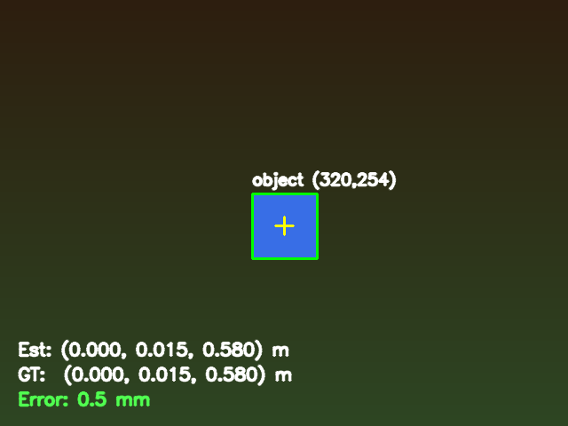
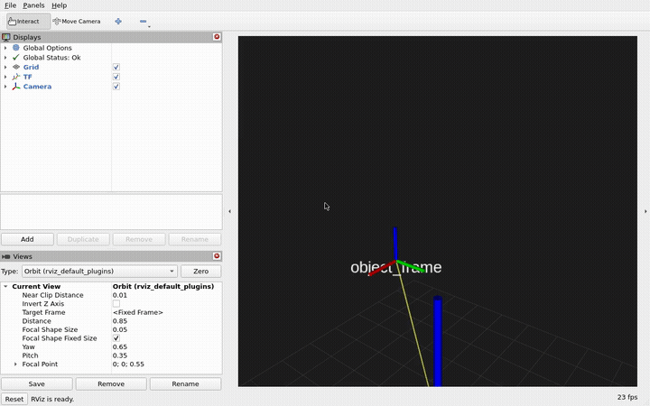
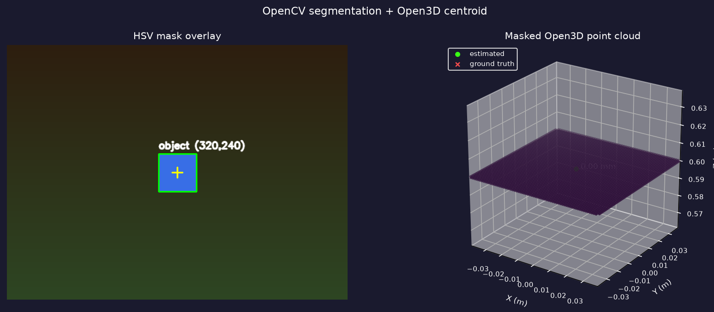
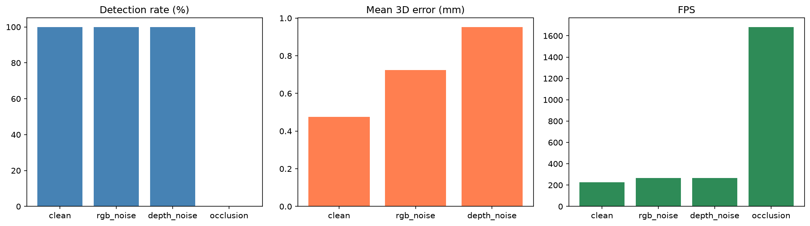

# RGB-D Object Pose via HSV Detection and Open3D Point Cloud Localization

[](https://www.python.org/)
[](https://opencv.org/)
[](http://www.open3d.org/)
[](https://numpy.org/)
[](https://docs.ros.org/en/humble/)
[](https://github.com/ros2/rclcpp)
[](https://developer.nvidia.com/isaac-sim)
[](https://gazebosim.org/)
[](https://www.docker.com/)
[](https://colab.research.google.com/)

This repo benchmarks classical **RGB-D** colored-cube **3D position** using **OpenCV** HSV detection and a masked **Open3D** point-cloud centroid, with millimeter error scored against simulator ground truth in **NumPy**. Scenario evals run under clean, RGB noise, depth noise, and occlusion conditions (~**0.5 mm** mean error on clean frames). **ROS2 Humble** integration publishes live pose over **TF**, visualizes in **RViz**, includes an **rclcpp** C++ latency monitor, and ships as a **Docker** demo. **Colab-ready** notebooks walk through setup, the pipeline, evals, and ROS2, using RGB-D frames from **Isaac Sim**, **Gazebo**, or bundled synthetic exports.

**Links:** [Demo](#demo) · [Report (PDF)](report.pdf) · [Quick start](#quick-start) · [Evaluation](#evaluation) · [Notebooks](#notebooks) · [Simulation](#simulation) · [ROS2](#ros2) · [Next steps](#next-steps)

<p align="center">
  
</p>
<p align="center"><sub><b>OpenCV</b> · detection overlay on RGB-D frames</sub></p>

<p align="center">
  
</p>
<p align="center"><sub><b>ROS2</b> · live TF tracking in RViz</sub></p>

<p align="center">
  
</p>
<p align="center"><sub><b>Open3D</b> · masked depth point cloud + 3D centroid</sub></p>

---

## At a glance

| | |
|--|--|
| **Question** | How far does **HSV + Open3D mask point cloud** localization get for 3D cube pose with simulator ground truth? |
| **Method** | OpenCV HSV/contours → mask → Open3D point cloud + outlier filter → 3D centroid (mm error) |
| **Data** | **Isaac Sim** → **Gazebo** → bundled synthetic RGB-D |
| **Clean eval** | **100%** detection · **~0.5 mm** mean 3D error |
| **Occlusion eval** | **0%** detection when band masks cube center (expected) |
| **Noise evals** | RGB / depth perturbation scenarios |
| **ROS2** | RGB-D topics · TF · **rclcpp** monitor · **RViz** · **Docker** |

---

## Quick start

### Colab

1. Upload this folder to Google Drive: `MyDrive/object-pose-estimation/`
2. Run all notebooks in order:
   - [`notebooks/setup.ipynb`](notebooks/setup.ipynb)
   - [`notebooks/data.ipynb`](notebooks/data.ipynb) *(local export, optional)*
   - [`notebooks/pipeline.ipynb`](notebooks/pipeline.ipynb)
   - [`notebooks/evals.ipynb`](notebooks/evals.ipynb)
   - [`notebooks/ros2.ipynb`](notebooks/ros2.ipynb)

### Local (Jupyter)

Notebooks are **not Colab-only**. Each one bootstraps via [`notebooks/colab_utils.py`](notebooks/colab_utils.py) (`runpy` load → `setup_notebook()`, Drive mount on Colab, `python -m pip` install, `%matplotlib inline`).

```bash
python -m venv .venv && source .venv/bin/activate
pip install -e ".[dev]"

# Open notebooks/*.ipynb and Run All, or execute headless from repo root:
export MPLCONFIGDIR=.mplcache
jupyter nbconvert --execute --to notebook --inplace notebooks/setup.ipynb
jupyter nbconvert --execute --to notebook --inplace notebooks/pipeline.ipynb
jupyter nbconvert --execute --to notebook --inplace notebooks/evals.ipynb
jupyter nbconvert --execute --to notebook --inplace notebooks/ros2.ipynb
```

On a local run, `pipeline.ipynb` should report sub-millimeter 3D error on bundled frames in `data/synthetic_exports/` (typically **~0.5 mm** mean; per-frame overlays may round to **0 mm**). Plots render inline in the notebook (no `!pip` shell alias needed).

### CLI sanity check

```bash
pip install -e .

# One-frame smoke test (synthetic)
python -c "
from data.synthetic import render_frame
from rgbd_pose.detection import ObjectDetector
from rgbd_pose.pose import PoseEstimator

frame = render_frame()
det = ObjectDetector().detect(frame.rgb)
pose = PoseEstimator(frame.intrinsics, depth_scale=0.001).estimate(frame.depth, det.center_px, mask=det.mask)
print('GT :', frame.gt_pose)
print('Est:', pose)
print('err:', f'{(pose.distance_to(frame.gt_pose)*1000):.1f} mm' if pose else 'N/A')
"

# Full scenario sweep (~10 s)
python evals/run_evals.py --num_frames 20
```

If both CLI commands run without errors, the core logic matches what the notebooks execute.

**Colab vs local:** Colab runs the **perception pipeline** on exported frames (Drive mount only). **Isaac Sim export** requires a local machine with NVIDIA GPU + Isaac installed — it does not run inside Colab.

### Local sim export (workstation)

Isaac is the intended sim backend. Run [`notebooks/data.ipynb`](notebooks/data.ipynb) locally — it auto-picks **Isaac → Gazebo → `synthetic_exports/`** by availability, then calls `export_sim_frames()`. Copy exports to Drive or use them locally.

Manual export (optional):

```python
from data.frame import export_sim_frames
export_sim_frames("isaac", "data/isaac_exports", num_frames=20)
export_sim_frames("gazebo", "data/gazebo_exports", num_frames=10)
export_sim_frames("synthetic", "data/synthetic_exports", num_frames=20)
```

`data/frame.py` + backends probe Isaac (`omni.isaac.kit` / `isaacsim`) or Gazebo (`gz sim`). **Isaac:** headless `SimulationApp` + `Camera` + `VisualCuboid` when Isaac is installed (GPU required). **Gazebo:** exports real RGB-D from `assets/cube/cube_rgbd.sdf` when `gz` is on PATH. Without a sim runtime, `export_sim_frames()` writes to `data/synthetic_exports/` instead of the sim folders.

`load_frame()` in `data/frame.py` loads from disk: **Isaac exports** → **Gazebo exports** → **`synthetic_exports/`**.

Upload exports to Drive:

```
MyDrive/object-pose-estimation/data/synthetic_exports/
MyDrive/object-pose-estimation/data/isaac_exports/   # after local Isaac export
```

---

## Table of contents

- [At a glance](#at-a-glance)
- [Background](#background)
- [Tech stack](#tech-stack)
- [Pipeline](#pipeline)
- [Project structure](#project-structure)
- [Evaluation](#evaluation)
- [Demo](#demo)
- [Notebooks](#notebooks)
- [Simulation](#simulation)
- [ROS2](#ros2)
- [Next steps](#next-steps)
- [License](#license)

---

## Background

Classic RGB-D perception stack without a learned model: find a color blob with OpenCV, build a masked depth point cloud with Open3D (statistical outlier removal + centroid), and compare to ground truth from export metadata (`data/isaac_exports/`, `data/gazebo_exports/`, `data/synthetic_exports/`) or in-memory `data/synthetic.py` (eval scenarios) so you can report **3D error in millimeters** and **detection rate** under noise and occlusion.

The repo covers the full path: Isaac Sim RGB-D export on a GPU workstation, notebooks (`setup` → `data` → `pipeline` → `evals` → `ros2`), perturbation evals, and a ROS2 stack (`rgbd_pose_node` + C++ latency monitor + optional RViz capture via `./ros2/run_demo.sh`).

---

## Tech stack

| Area | Components |
|------|------------|
| **Simulation (primary)** | **Isaac Sim** — `notebooks/data.ipynb`, `data/isaac.py`, `data/isaac_exports/` (real exports only) |
| **Simulation (secondary)** | **Gazebo** — `notebooks/data.ipynb`, `data/gazebo.py`, `data/gazebo_exports/` (real exports only) |
| **Bundled demo** | `data/synthetic_exports/` — offline PNG+JSON frames for notebooks |
| **Vision** | OpenCV (HSV, contours, segmentation mask) |
| **3D geometry** | Open3D (depth → point cloud, outlier removal, centroid), `data/geometry.py` (`CameraIntrinsics`, `Pose3D`) |
| **Eval synthetic** | `data/synthetic.py` — in-memory scenarios for `evals/run_evals.py` |
| **Eval** | `evals/run_evals.py`, `evals.ipynb` — four perturbation scenarios |
| **Robotics** | `rgbd_pose_node.py`, `ros2.ipynb`, `ros2/run_demo.sh` (`--viz` for RViz GIF) |
| **Python** | `pyproject.toml` — `pip install -e .` |
| **Runtime** | Isaac export: local **NVIDIA GPU** + Isaac Sim · Pipeline: Colab CPU (Python 3.10–3.12), local Jupyter, or CLI · Open3D requires Python &lt; 3.13 |

---

## Pipeline

```
RGB-D frame (Isaac / Gazebo / synthetic)
        │
        ▼
OpenCV HSV + contours  ──►  segmentation mask
        │
        ▼
Open3D masked point cloud + outlier filter  ──►  3D centroid (x, y, z) in camera optical frame
        │
        ▼
compare to gt_pose  ──►  error (m), overlays, eval metrics
```

**Frame source priority** (`data/frame.py`):

1. `data/isaac_exports/` (real Isaac export)
2. `data/gazebo_exports/` (real Gazebo export)
3. `data/synthetic_exports/` (bundled demo)

Sim folders are empty until you run `notebooks/data.ipynb` locally with Isaac or Gazebo. Eval scenarios use in-memory `data/synthetic.py` (`generate_sequence`).

---

## Project structure

```
object-pose-estimation/
├── README.md
├── LICENSE
├── report.pdf
├── pyproject.toml
├── assets/
│   ├── cube/
│   │   └── cube_rgbd.sdf       # Gazebo scene
│   └── demo/                   # Demo media (PNG, GIF, sample eval CSV)
├── notebooks/
│   ├── setup.ipynb
│   ├── data.ipynb
│   ├── pipeline.ipynb
│   ├── evals.ipynb
│   ├── ros2.ipynb
│   └── colab_utils.py          # Bootstrap, setup_notebook(), install_requirements(), …
├── rgbd_pose/
│   ├── detection.py            # HSV detection
│   └── pose.py                 # PoseEstimator (uses data/geometry.py)
├── data/
│   ├── geometry.py             # CameraIntrinsics, Pose3D
│   ├── frame.py                # RGBDFrame + disk I/O + load_frame()
│   ├── synthetic.py            # CPU renderer
│   ├── isaac.py                # Isaac Sim export
│   ├── gazebo.py               # Gazebo Sim export
│   ├── isaac_exports/          # real Isaac exports (empty until local export)
│   ├── gazebo_exports/         # real Gazebo exports (empty until local export)
│   └── synthetic_exports/      # bundled demo frames
├── evals/
│   ├── run_evals.py            # scenario sweep (also used by evals.ipynb)
│   ├── metrics.py              # metrics + visualization
│   ├── build_report.py         # Regenerate report.pdf
│   └── results/
├── ros2/
│   ├── run_demo.sh                 # Docker: build + run monitor + demo publisher
│   └── object_pose/                # colcon package (pose node + demo publishers + C++ monitor)
```

---

## Evaluation

### What it measures

| Metric | Meaning |
|--------|---------|
| **Detection rate** | Fraction of frames where HSV+contour finds the cube |
| **Mean 3D error** | Euclidean distance (m) between estimated and GT center, detected frames only |
| **FPS** | Wall-clock detect + pose time per frame (not GPU sim rate) |

### Scenarios

Each scenario is a **sequence of synthetic frames** with a slowly moving cube (`data/synthetic.generate_sequence`):

| Scenario | Perturbation | What to expect |
|----------|--------------|----------------|
| `clean` | None | Baseline error and detection |
| `rgb_noise` | Gaussian noise on RGB (σ≈15) | Detection may drop if color breaks HSV band |
| `depth_noise` | Gaussian noise on depth (≈20 mm) | Error increases; detection often unchanged |
| `occlusion` | Horizontal band over cube center | Detection should drop sharply |

### How to run

**CLI (local):**

```bash
python evals/run_evals.py --num_frames 20
python evals/run_evals.py --num_frames 50 --out evals/results/eval_results.csv
```

**Notebook (Colab):** [`notebooks/evals.ipynb`](notebooks/evals.ipynb) — table + bar charts, saves CSV to Drive.

**Programmatic:**

```python
from evals.run_evals import run_all_evals

df = run_all_evals(num_frames=20)
print(df[["scenario", "detection_rate_pct", "mean_error_mm", "fps"]])
```

### Sample results

From `python evals/run_evals.py --num_frames 20` on the bundled data:

| Scenario | Detection % | Mean error (mm) | FPS |
|----------|-------------|-----------------|-----|
| clean | 100.0 | 0.5 | ~250 |
| rgb_noise | 100.0 | 0.7 | ~275 |
| depth_noise | 100.0 | 0.8 | ~275 |
| occlusion | 0.0 | — | ~1710 |

`occlusion` masks the cube band — **0%** detection is expected. `depth_noise` raises error slightly when detection holds; Open3D mask point-cloud centroid is more stable than single-pixel depth under noise.

<p align="center">
  
</p>

Bump `--num_frames` for stabler averages on noisy scenarios.

---

## Demo

Hero visuals (GIFs + point cloud) are at the top of this README. The eval chart lives in [Evaluation](#evaluation).

| Asset | What it shows |
|-------|----------------|
| `demo.gif` | OpenCV detection overlay |
| `ros2_rviz_demo.gif` | ROS2 TF tracking in RViz |
| `point_cloud_3d.png` | Open3D mask point cloud + centroid |
| `eval_summary.png` | Four-scenario eval charts |
| `sample_eval_results.csv` | Eval metrics table |
| `ros2_monitor_sample.log` | C++ latency monitor output |
| `report.pdf` | Full write-up (`python evals/build_report.py`) |

---

## Notebooks

| Notebook | Purpose |
|----------|---------|
| `setup.ipynb` | Drive mount (Colab), deps, GPU/sim checks, first RGB-D frame |
| `data.ipynb` | Auto-pick Isaac/Gazebo/synthetic export locally (optional) |
| `pipeline.ipynb` | Detect → 3D pose → overlay + quick FPS benchmark |
| `evals.ipynb` | Four scenarios, metrics table + charts → CSV |
| `ros2.ipynb` | ROS2 topics, Python pose node, C++ monitor, Docker demo |

**Run order:** `setup` → `data` *(local export, optional)* → `pipeline` → `evals` → `ros2`

**Setup cells** (all notebooks): `runpy` load `colab_utils.py` → `setup_notebook()` (Colab: mounts Drive at `/content/drive/MyDrive/object-pose-estimation`; local: repo root). Deps install with `python -m pip`, not shell `!pip`.

**Expected local outputs:** `pipeline` sub-millimeter error on `synthetic_exports/` (~**0.5 mm** clean mean; see [Evaluation](#evaluation)); `evals` ~100% detection on clean, 0% on full occlusion.

---

## Simulation

Local simulators produce RGB-D frames + ground truth for the perception stack. Export on a **GPU workstation** (Isaac) or **Gazebo machine**, then notebooks load PNG+JSON from the repo or Drive. **Simulators do not run in Colab.**

### Data code in this repo

| File | Role |
|------|------|
| [`data/frame.py`](data/frame.py) | `RGBDFrame`, disk I/O, `load_frame()` |
| [`data/synthetic.py`](data/synthetic.py) | CPU renderer |
| [`data/isaac.py`](data/isaac.py) | Isaac Sim exporter |
| [`data/gazebo.py`](data/gazebo.py) | Gazebo Sim exporter |
| [`notebooks/data.ipynb`](notebooks/data.ipynb) | Auto-pick sim backend and export (local workstation) |
| [`notebooks/colab_utils.py`](notebooks/colab_utils.py) | `try_isaac_import()`, `try_gazebo_cli()`, `check_gpu()` in `setup.ipynb` |

Bundled demo frames live in `data/synthetic_exports/`. Install **Isaac Sim** (GPU) or **Gazebo Sim** (`gz`) locally and run `notebooks/data.ipynb` to populate `isaac_exports/` or `gazebo_exports/`.

### Intended scene (Isaac and Gazebo)

- **Object:** colored cube (~8 cm)
- **Sensor:** RGB-D camera, 640×480, pinhole intrinsics
- **Ground truth:** cube center in camera optical frame
- **Export:** `frame_NNN_rgb.png`, `frame_NNN_depth.png` (uint16 mm), `frame_NNN_meta.json`

**Frame priority** (`data/frame.py`): Isaac exports → Gazebo exports → `synthetic_exports/`.

### Local export

Run [`notebooks/data.ipynb`](notebooks/data.ipynb) — it checks Isaac/Gazebo availability and exports to the matching folder (or `synthetic_exports/` when no sim is installed). Or from Python:

```python
from data.frame import export_sim_frames
export_sim_frames("isaac", "data/isaac_exports", num_frames=20)
export_sim_frames("gazebo", "data/gazebo_exports", num_frames=10)
export_sim_frames("synthetic", "data/synthetic_exports", num_frames=20)
```

Copy to Drive for Colab:

```
MyDrive/object-pose-estimation/data/synthetic_exports/
MyDrive/object-pose-estimation/data/isaac_exports/
MyDrive/object-pose-estimation/data/gazebo_exports/
```

Real Isaac exports take precedence over Gazebo when both exist on disk.

### Isaac Sim (primary)

| Component | Requirement |
|-----------|-------------|
| **GPU** | NVIDIA RTX-class recommended (Isaac is GPU-accelerated; OpenCV pipeline is fine on CPU) |
| **Isaac Sim** | [Isaac Sim](https://developer.nvidia.com/isaac-sim) 4.x+ or [Isaac Lab](https://isaac-sim.github.io/IsaacLab/) |
| **Python** | Isaac's bundled `python.sh` if `omni.isaac.kit` is not on your default `python` |

```bash
python -c "from notebooks.colab_utils import check_gpu, try_isaac_import; print(check_gpu()); print(try_isaac_import())"
```

**Wiring Isaac** — `export_isaac()` in [`data/isaac.py`](data/isaac.py) implements headless export. On a GPU machine with Isaac installed:

```bash
# Use Isaac's bundled python if omni.isaac is not on default PATH:
~/.local/share/ov/pkg/isaac-sim-*/python.sh -c "from data.frame import export_sim_frames; export_sim_frames('isaac', 'data/isaac_exports', num_frames=20)"
```

To customize the scene, edit `_run_export()` in `data/isaac.py` (camera pose, cube color, warmup steps).

### Gazebo (CPU-friendly — real export when `gz` is installed)

Install [Gazebo Sim](https://gazebosim.org/docs/harmonic/install) (Harmonic or later) so `gz sim` is on PATH. Headless ogre2 rendering is required.

```bash
# Export real RGB-D frames into data/gazebo_exports/
python -c "from data.frame import export_sim_frames; export_sim_frames('gazebo', 'data/gazebo_exports', num_frames=20)"

# Load first bundled or exported frame
python -c "from data.frame import load_frame; f=load_frame('.'); print(f.source)"
```

**Wiring notes** — scene in [`assets/cube/cube_rgbd.sdf`](assets/cube/cube_rgbd.sdf); exporter in [`data/gazebo.py`](data/gazebo.py).

**ROS 2 bridge (typical lab setup)** — subscribe and save:

| Topic | Use |
|-------|-----|
| `/rgb/image_raw` | PNG |
| `/depth/image_raw` | uint16 mm PNG |
| `/camera/camera_info` | intrinsics in meta.json |

### meta.json example

```json
{
  "source": "isaac_sim",
  "gt_pose_m": [0.0, 0.0, 0.6],
  "intrinsics": {
    "fx": 525.0, "fy": 525.0, "cx": 320.0, "cy": 240.0,
    "width": 640, "height": 480
  }
}
```

---

## ROS2

Maps the Python pipeline to standard ROS2 interfaces. **`ros2.ipynb` is part of the core notebook run** (after `evals`) — topic table, data-flow, and C++ monitor source.

**Run locally (macOS or Linux):** start Docker Desktop, then from the repo root:

```bash
./ros2/run_demo.sh              # headless latency monitor (~5 s)
./ros2/run_demo.sh --viz        # record RViz TF demo → assets/demo/ros2_rviz_demo.gif
```

Headless mode builds the colcon package, runs the RGB-D detector node + C++ subscriber. Example log line:

```
[pose_latency_monitor]: [20] pos=(-0.080, 0.063, 0.595) latency=28.6 ms fps~=10.1 frame=camera_optical_frame
```

Full sample: [`assets/demo/ros2_monitor_sample.log`](assets/demo/ros2_monitor_sample.log). RViz capture: see [Demo](#demo) (`ros2_rviz_demo.gif`) or run `./ros2/run_demo.sh --viz`.

Perception eval numbers (detection %, 3D error) are in [Evaluation](#evaluation).

```
/camera/camera_info  ──┐
/rgb/image_raw       ──┼──► detector ──► 2D center
/depth/image_raw     ──┘         │
                                 ▼
                          depth + intrinsics
                                 │
                                 ▼
                    /object_pose (PoseStamped)
                                 │
                                 ▼
                    tf2: object_frame → camera_link → RViz
```

| Stage | Topic | Type |
|-------|-------|------|
| RGB | `/rgb/image_raw` | `sensor_msgs/Image` |
| Depth | `/depth/image_raw` | `sensor_msgs/Image` (`16UC1` mm) |
| Intrinsics | `/camera/camera_info` | `sensor_msgs/CameraInfo` |
| Pose | `/object_pose` | `geometry_msgs/PoseStamped` |
| TF | `object_frame` | relative to `camera_link` / `camera_optical_frame` |

Pose is estimated in the **camera optical frame** (Z forward). Apply the standard optical↔link rotation when bridging nodes that expect `camera_link`.

**Python node:** `ros2/object_pose/scripts/rgbd_pose_node.py` subscribes to RGB-D topics, runs the detector, publishes `/object_pose` and TF `object_frame`.

**C++ monitor:** `ros2/object_pose/src/pose_latency_monitor.cpp` subscribes to `/object_pose`, prints stamp latency and rolling FPS (`ros2 run object_pose pose_latency_monitor`). Build/run via `./ros2/run_demo.sh` or your own colcon workspace. Details in [`notebooks/ros2.ipynb`](notebooks/ros2.ipynb).

---

## Next steps

**Limitations:** HSV detection is lighting-sensitive; pose is **position-only**; sim folders are empty until you export locally — bundled demo is in `data/synthetic_exports/`.

1. **Isaac Sim export** — On a GPU workstation: run `notebooks/data.ipynb` (auto-picks Isaac when installed)
2. **Gazebo export** — Run `notebooks/data.ipynb` on a machine with `gz` on PATH, then re-run `pipeline` + `evals` on real sim RGB-D (CPU, no GPU)
3. **ROS2 on hardware** — Publish `/object_pose` from a live camera + detector node; run `./ros2/run_demo.sh` pattern on-robot with `ros2 run object_pose pose_latency_monitor`.
4. **Stronger perception** — Tune HSV for Isaac/Gazebo lighting, or swap in a learned detector / 6D pose if HSV is too brittle.

---

## License

MIT
